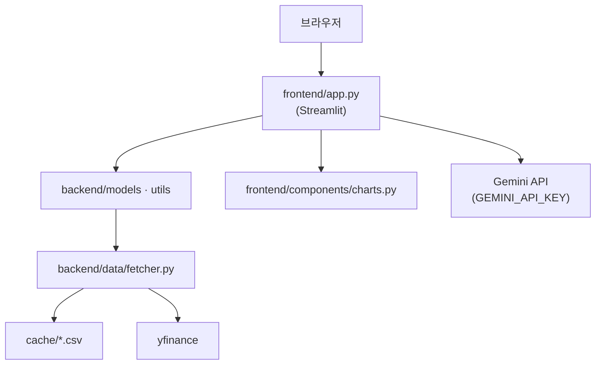

# RISKDOC 개발자 가이드

---

## 1. 프로젝트 개요

**RISKDOC**(코드 주석: RiskGuard AI)는 GJR-GARCH + Student-t VaR/ES로 일별 금융 리스크를 산출하고, Streamlit 대시보드와 Gemini 챗봇으로 해석하는 **단일 프로세스 웹 앱**이다.


| 항목       | 내용                                          |
| -------- | ------------------------------------------- |
| 진입점      | `streamlit run frontend/app.py`             |
| 포트       | 8501                                        |
| DB       | 없음 (CSV 파일 캐시만 사용)                          |
| REST API | 없음                                          |
| 인증       | 없음                                          |
| AI       | Gemini 2.5 Flash — 챗봇만 사용, VaR 수치는 통계 모델 산출 |


### 1.1 아키텍처




**3계층 (논리 분리, 물리 단일 프로세스)**


| 계층           | 경로                                  | 역할                 |
| ------------ | ----------------------------------- | ------------------ |
| Presentation | `frontend/`                         | UI, 캐싱, 챗봇, 장마감 라벨 |
| Business     | `backend/models/`, `backend/utils/` | GARCH, VaR, 지표, 랭킹 |
| Data         | `backend/data/fetcher.py`           | 시세 수집·캐시·fallback  |


---

## 2. 시작하기

### 2.1 요구사항

- Python **3.11+** (로컬·CI 권장; Dockerfile은 `3.9-slim`)
- pip, (선택) Docker Desktop
- 네트워크: yfinance, Gemini API

### 2.2 설치 및 실행

```bash
python -m venv venv
# Windows: venv\Scripts\activate  |  Mac/Linux: source venv/bin/activate
pip install -r requirements.txt
```

프로젝트 루트에 `.env` 생성:

```
GEMINI_API_KEY=발급받은_API_키
```

```bash
streamlit run frontend/app.py
# → http://localhost:8501
```

### 2.3 Docker

```bash
docker compose up --build
docker compose down   # 종료
```

`docker-compose.yml`: 서비스 `riskdoc-app`, `env_file: .env`, 포트 `8501:8501`.

---

## 3. 프로젝트 구조

```
risk_management_platform/
├── .github/workflows/ci.yml
├── .streamlit/config.toml          # dark theme
├── backend/
│   ├── data/fetcher.py             # TICKERS, yfinance, CSV 캐시
│   ├── models/garch_model.py       # GJR-GARCH(1,1)
│   ├── models/var_calculator.py    # VaR, ES
│   └── utils/
│       ├── indicators.py           # RSI, SMA, BB, 골든크로스
│       └── risk_ranking.py         # 10종목 랭킹
├── frontend/
│   ├── app.py                      # 메인 앱 (~590줄)
│   └── components/charts.py        # Plotly 3종
├── docker/Dockerfile
├── docker-compose.yml
├── requirements.txt
└── docs/                           # 본 가이드
```

### 3.1 의존성 (`requirements.txt`)


| 패키지                         | 용도       |
| --------------------------- | -------- |
| streamlit, plotly           | UI·차트    |
| yfinance, pandas, numpy     | 데이터      |
| arch, scipy                 | GARCH·통계 |
| google-genai, python-dotenv | 챗봇       |


---

## 4. 데이터 흐름

### 4.1 사용자 입력 → 분석

사이드바: `ticker_name` → `TICKERS` 매핑, `confidence_pct`(90~99.9%) → `alpha = 1 - confidence/100`, `period`, `investment`.

### 4.2 `load_analysis` (핵심 파이프라인)

```python
@st.cache_data(ttl=3600)
def load_analysis(ticker, period, alpha, investment):
    long_df = fetch_price_data(ticker, period="5y")      # 항상 5년 수집
    long_indicators = calculate_all_indicators(long_df)  # 지표는 5년 전체
    df = long_df.iloc[-days:]                            # GARCH/VaR용 구간 슬라이스
    garch_res = fit_gjr_garch(df["log_return"])
    var_res = calculate_var_es(garch_res, df["Close"], alpha, investment)
    indicators = long_indicators를 df.index로 슬라이스
    return df, garch_res, var_res, indicators
```

**설계 포인트**: SMA60·BB 등 장기 지표 안정화를 위해 **5년 데이터로 지표 계산 후 분석 기간만 잘라 사용**.

### 4.3 랭킹 (`compute_risk_ranking`)

- 현재 종목: `precomputed` dict로 **재계산 생략**
- 나머지 9종목: 동일 5y→슬라이스→GARCH→VaR
- 정렬: `abs(var_amount)` 내림차순 → TOP 3 표시

### 4.4 챗봇

- 종목·기간·α·투자금 변경 시 `session_state.messages` 초기화 + 환영 메시지
- `system_instruction`에 VaR/ES 원화, 랭킹, SMA, 거래량, CoT 4단계 지침 포함
- 매수/매도 지시 금지

---

## 5. 금융 모델 (요약)

### 5.1 로그 수익률

$r_t = \ln(P_t / P_{t-1})$ — `fetcher.py`에서 계산.

### 5.2 GJR-GARCH(1,1)

$$\sigma_t^2 = \omega + \alpha \varepsilon_{t-1}^2 + \gamma I_{t-1}\varepsilon_{t-1}^2 + \beta\sigma_{t-1}^2$$

- `arch_model(..., p=1, o=1, q=1, dist="t")`
- 수익률 ×100 피팅 후 σ ÷100 복원
- `forecast_volatility`: 1-step ahead 예측 σ

### 5.3 VaR / ES

$$\text{VaR}*t = z*\alpha \cdot \sigma_t, \quad z_\alpha = F_t^{-1}(\alpha \mid \nu)$$

- `var_today` = $z_\alpha \times$ `forecast_volatility`
- `var_amount` = `var_today` × `investment`
- ES: `_es_t_quantile` (t-분포 꼬리 평균 계수) × σ

### 5.4 차트 VaR 가격 변환

`var_line = close + close * var_series` (수익률 VaR의 선형 근사)

---

## 6. 캐싱


| 계층        | 위치                                         | TTL / 조건                                                              |
| --------- | ------------------------------------------ | --------------------------------------------------------------------- |
| Streamlit | `@st.cache_data(ttl=3600)`                 | `load_analysis`, `get_ranking` — 키에 ticker·period·alpha·investment 포함 |
| CSV       | `backend/data/cache/{ticker}_{period}.csv` | **장마감 기준** 무효화 (KR 15:30, 해외 KST 06:00)                               |


Fallback: yfinance 실패 → 만료 CSV → 결정적 합성 OHLCV (`_generate_fallback_price_data`). **UI 경고 없음**.

캐시 수동 삭제: `backend/data/cache/` 내 CSV 삭제 후 재실행.

---

## 7. 개발·확장

### 7.1 종목 추가

`backend/data/fetcher.py`의 `TICKERS` dict에 항목 추가. yfinance 지원 심볼 사용.

### 7.2 신뢰수준 UI

슬라이더 90.0~99.9% (0.1% 단계). README의 고정 α=0.01/0.05 방식은 **구버전**.


### 7.3 확장 시 병목

종목 수 증가 → 랭킹 루프 GARCH 비용 선형 증가. 대규모 확장 시 DB·배치 처리 검토.

---

## 8. 테스트·CI·배포

### 8.1 로컬 스모크 테스트

```bash
python backend/data/fetcher.py
python backend/models/garch_model.py
python backend/models/var_calculator.py
python backend/utils/risk_ranking.py
```

### 8.2 CI (`.github/workflows/ci.yml`)

- 트리거: `push` / `PR` → `dev`, `main`
- Python 3.11, import 4종 검증, `docker build`
- **pytest 없음**

### 8.3 브랜치 전략 (README 기준)


| 브랜치           | 용도                     |
| ------------- | ---------------------- |
| `main`        | 최종 배포                  |
| `backend`     | 백엔드 작업                 |
| `UI`          | 프론트 작업                 |


작업 → `backend / UI` → `main` merge.

### 8.4 환경 변수


| 변수               | 필수      | 용도         |
| ---------------- | ------- | ---------- |
| `GEMINI_API_KEY` | 챗봇 사용 시 | Gemini API |


`.env`는 gitignore. `.streamlit/secrets.toml`도 ignore되나 코드는 `.env` 우선 사용.

---

## 9. 한계


| 이슈           | 설명                               |
| ------------ | -------------------------------- |
| Fallback 무표시 | 합성 데이터 사용 시 사용자 알림 없음            |
| 랭킹 지연        | 9종목 순차 GARCH — 캐시 미스 시 수십 초      |
| Python 버전    | Dockerfile 3.9 vs CI/README 3.11 |
| 인증·DB 없음     | 세션 종료 시 챗봇 이력 소실                 |

---

## 10. 빠른 참조


| 작업     | 명령/파일                                 |
| ------ | ------------------------------------- |
| 앱 실행   | `streamlit run frontend/app.py`       |
| Docker | `docker compose up --build`           |
| 종목 정의  | `backend/data/fetcher.py` → `TICKERS` |
| VaR 로직 | `backend/models/var_calculator.py`    |
| UI·챗봇  | `frontend/app.py`                     |
| 차트     | `frontend/components/charts.py`       |


**관련 문서**: [USER_GUIDE.md](./USER_GUIDE.md) · [README.md](../README.md)
