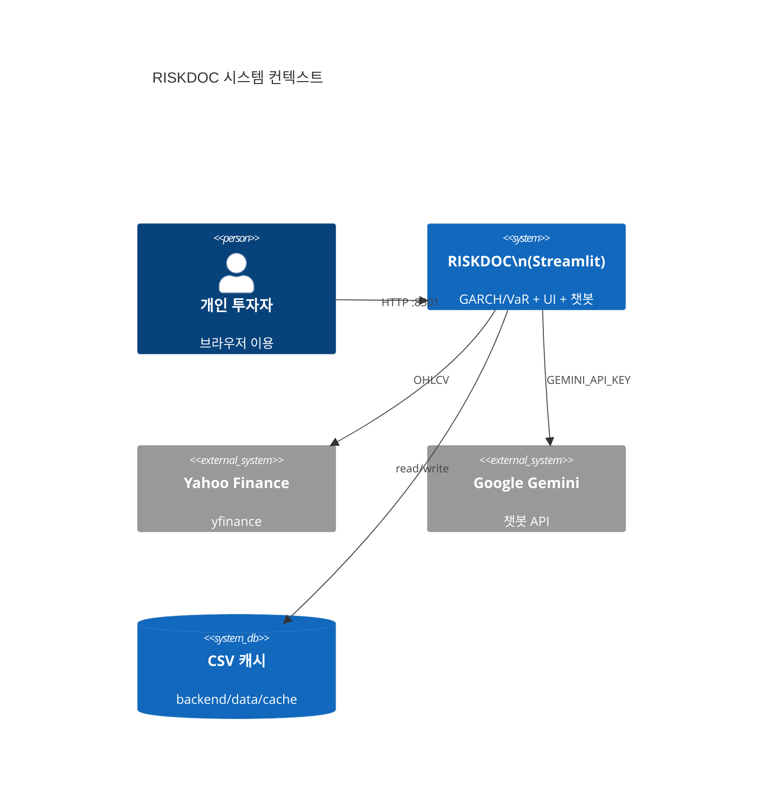
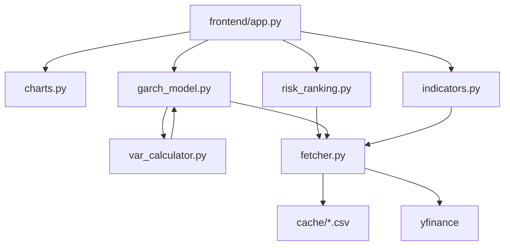
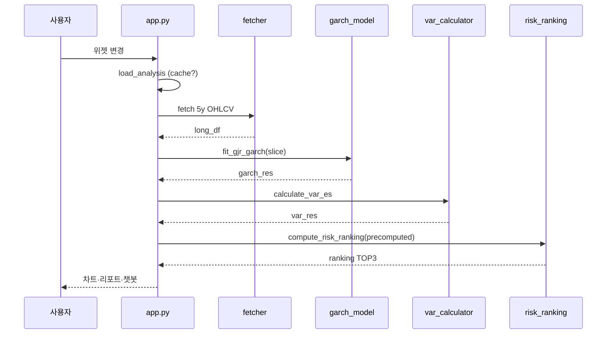

# 통계·AI 모델 기반 일별 금융 자산 리스크 관리 플랫폼 (RISKDOC)

> **8조: 김성택(32210736), 도현석(32231447)**

## 최종 보고서


| 항목    | 내용                                                                                                                   |
| ----- | -------------------------------------------------------------------------------------------------------------------- |
| 프로젝트명 | RISKDOC — 금융 자산 리스크 관리 플랫폼                                                                                           |
| 과목    | 오픈소스 소프트웨어 (OSS)                                                                                                     |
| 기술 스택 | Python 3.11, Streamlit, GJR-GARCH, Gemini API                                                                        |
| 저장소   | [https://github.com/Dooman-cloud/risk_management_platform](https://github.com/Dooman-cloud/risk_management_platform) |


---

## 목차

1. [프로젝트 개요](#1-프로젝트-개요)
2. [시스템 아키텍처](#2-시스템-아키텍처)
3. [상세 설계](#3-상세-설계)
4. [구현 내용](#4-구현-내용)
5. [테스트 결과 및 분석](#5-테스트-결과-및-분석)
6. [결론 및 향후 과제](#6-결론-및-향후-과제)
7. [AI 활용 내역 (바이브 코딩)](#7-ai-활용-내역-바이브-코딩)
8. [참고 문헌](#8-참고-문헌)
9. [용어 설명](#9-용어-설명)

---

## 1. 프로젝트 개요

### 1.1 배경 및 문제 정의

개인 투자자에게 널리 제공되는 금융 분석 도구는 RSI, 이동평균선, 볼린저 밴드 등 **기술적 지표**에 크게 의존한다. 이러한 지표는 전문가에게는 유용하나, 수치의 의미·한계·포트폴리오 전체 리스크와의 관계를 일반 투자자가 직관적으로 이해하기 어렵다.

한편 딥러닝·강화학습 기반의 AI 리스크 예측 모델은 높은 예측 성능을 기대할 수 있으나, (1) 금융 시계열의 비정상성·체제 전환, (2) 종목 간 이질성, (3) **Black-box 특성으로 인한 해석력 부족** 등의 한계가 있다. OSS 과제 범위와 개인 개발자가 운영 가능한 수준의 서비스를 고려할 때, 해석 가능한 통계 모델과 생성형 AI의 결합이 실용적 대안이 된다.

### 1.2 프로젝트 목표

본 프로젝트 **RISKDOC**(Risk Doctor / 리스크 관리 AI 플랫폼)는 다음 목표를 달성하고자 한다.


| 목표             | 설명                                                           |
| -------------- | ------------------------------------------------------------ |
| **정량적 리스크 산출** | GJR-GARCH(1,1)로 일별 조건부 변동성을 추정하고, Student-t 분포 기반 VaR·ES를 계산 |
| **직관적 시각화**    | Streamlit 대시보드와 Plotly 차트로 주가·VaR·변동성·보조 지표를 한 화면에 제공        |
| **비교 분석**      | 10개 지원 종목 중 예측 손실액(VaR) 상위 3개를 랭킹으로 표시                       |
| **자연어 해석**     | Google Gemini API 챗봇으로 수치 결과를 일반 투자자 언어로 설명 (매매 지시는 금지)      |
| **경량 운영**      | DB 없이 CSV 캐시·Streamlit 캐시로 단일 서버·Docker 배포 가능                |


### 1.3 프로젝트 범위

**범위 내**

- 국내 5종목·해외 2종목·지수 2종·금 1종 (총 10종목) 일별 리스크 분석
- 신뢰수준 90.0% ~ 99.9% 슬라이더, 분석 기간 1주 ~ 5년, 투자금 입력
- 로컬 실행 및 Docker Compose 배포
- GitHub Actions CI (import 검증, Docker build)

**범위 외**

- 사용자 인증·권한·결제
- 관계형 DB·실시간 호가·주문 연동
- DL/RL 기반 가격 예측
- 모바일 네이티브 앱

### 1.4 기대 효과

- 개인 투자자가 **“내일 최대 얼마까지 잃을 수 있는가”** 를 신뢰수준과 함께 파악
- 기술 지표는 보조 역할로 유지하면서 **VaR·ES 중심** 의사결정 보조
- 통계 모델의 투명성으로 AI 금융 서비스에 대한 신뢰 형성에 기여

---

## 2. 시스템 아키텍처

### 2.1 전체 구조

RISKDOC는 **Streamlit 단일 프로세스**이다. REST API 서버·메시지 큐·관계형 DB는 사용하지 않으며, 시각화·비즈니스 로직·파일 기반 데이터 접근이 하나의 Python 프로세스에서 실행된다.




### 2.2 시스템 참조 계층


| 계층               | 디렉터리                                               | 책임                                   |
| ---------------- | -------------------------------------------------- | ------------------------------------ |
| **시각화** | `frontend/app.py`, `frontend/components/charts.py` | UI, 위젯, `@st.cache_data`, 챗봇, 장마감 라벨 |
| **Business**     | `backend/models/`, `backend/utils/`                | GARCH, VaR/ES, 기술 지표, 종목 랭킹          |
| **Data**         | `backend/data/fetcher.py`                          | yfinance 호출, CSV 캐시, fallback 합성 데이터 |





### 2.3 런타임 및 배포


| 환경         | 구성                                                                  |
| ---------- | ------------------------------------------------------------------- |
| **로컬**     | `streamlit run frontend/app.py` → `http://localhost:8501`           |
| **Docker** | `docker compose up` — 서비스명 `riskdoc-app`, `env_file: .env`, 포트 8501 |
| **CI**     | GitHub Actions — Python 3.11, import smoke test, `docker build`     |


Dockerfile은 `python:3.9-slim`을 사용하나 CI·README는 3.11을 권장한다. 운영 시 버전 통일이 권장된다.

### 2.4 외부 의존성


| 서비스            | 용도       | 실패 시 동작                  |
| -------------- | -------- | ------------------------ |
| **yfinance**   | 주가 OHLCV | 만료 CSV → 결정적 합성 데이터      |
| **Gemini API** | 챗봇       | VaR/GARCH는 정상, 챗봇 오류 메시지 |


### 2.5 보안

- **인증 없음**: `:8501` 접근 가능한 누구나 이용
- **시크릿**: `GEMINI_API_KEY` — `.env` (gitignore)
- **챗봇**: 매수·매도 지시 금지 system prompt, 면책 문구 강제

### 2.6 브랜치 전략


| 브랜치       | 용도       |
| --------- | -------- |
| `main`    | 최종 배포    |
| `backend` | 백엔드 수정   |
| `UI`      | 프론트엔드 수정 |


작업 흐름: `backend` 또는 `UI`에서 개발 → 검증 후 `main` merge.

---

## 3. 상세 설계

### 3.1 데이터 설계

#### 3.1.1 종목 마스터 (`TICKERS`)

`backend/data/fetcher.py`에 하드코딩된 10종목:


| 표시명       | 티커        | 통화  |
| --------- | --------- | --- |
| 삼성전자      | 005930.KS | KRW |
| SK하이닉스    | 000660.KS | KRW |
| NAVER     | 035420.KS | KRW |
| KAKAO     | 035720.KS | KRW |
| 현대차       | 005380.KS | KRW |
| Apple     | AAPL      | USD |
| Tesla     | TSLA      | USD |
| S&P 500   | ^GSPC     | USD |
| KOSPI 200 | ^KS11     | KRW |
| Gold      | GC=F      | USD |


#### 3.1.2 OHLCV 스키마

yfinance `auto_adjust=True` 조정 종가 기준.


| 컬럼                             | 타입            | 설명                 |
| ------------------------------ | ------------- | ------------------ |
| Open, High, Low, Close, Volume | float         | 일별 시세              |
| log_return                     | float         | $\ln(P_t/P_{t-1})$ |
| index                          | DatetimeIndex | 거래일                |


#### 3.1.3 CSV 캐시

- 경로: `backend/data/cache/{safe_ticker}_{period}.csv`
- 유효성: **장마감 이후 생성된 파일**이면 유효
  - 한국(.KS, ^KS11): KST 15:30
  - 해외: KST 06:00 (미국장 마감 근사)
- 무효 시 yfinance 재수집; 실패 시 fallback 합성 데이터

### 3.2 금융 모델 설계

#### 3.2.1 GJR-GARCH(1,1)

조건부 분산:

$$\sigma_t^2 = \omega + \alpha \varepsilon_{t-1}^2 + \gamma I_{t-1}\varepsilon_{t-1}^2 + \beta \sigma_{t-1}^2$$

- $I_{t-1}=1$ when $\varepsilon_{t-1}<0$ (하락 충격 가중)
- 분포: Student-t (`dist="t"`)
- `arch` 피팅 시 수익률 ×100. 따라서, σ 결과 ÷100 하여 도출
- 1-step ahead `forecast_volatility` → 최신 종가 기준 다음날 예측 VaR·ES로 사용

#### 3.2.2 VaR / ES

$$\text{VaR}*t = z*\alpha \cdot \sigma_t, \quad z_\alpha = F_t^{-1}(\alpha \mid \nu)$$

$$\text{ES factor} = -\frac{f_t(z_\alpha)}{\alpha} \cdot \frac{\nu + z_\alpha^2}{\nu - 1}$$

- `var_today`, `es_today`: **음수** (손실 방향)
- `var_amount = var_today × investment` (원화 환산)

#### 3.2.3 보조 기술 지표


| 지표              | 파라미터    | 용도       |
| --------------- | ------- | -------- |
| RSI             | 14일     | 과매수/과매도  |
| SMA             | 20, 60일 | 추세·골든크로스 |
| Bollinger Bands | 20일, 2σ | 변동 범위    |
| EMA             | 20일     | 챗봇 컨텍스트  |


GARCH/VaR은 사용자 선택 **분석 기간** 구간으로 슬라이스하되, SMA60·BB 등은 **5년 전체 데이터**로 계산 후 동일 구간만 잘라 사용 — 통계 모델 학습 워밍업 구간 부족 방지.

### 3.3 UI/UX 설계

#### 3.3.1 사이드바 입력


| 위젯            | 변수                     | 범위           |
| ------------- | ---------------------- | ------------ |
| selectbox     | ticker_name → ticker   | 10종목         |
| slider        | confidence_pct → alpha | 90.0~99.9%   |
| select_slider | period_label → period  | 1주~5년        |
| number_input  | investment             | 원, step 100만 |


#### 3.3.2 메인 레이아웃

1. 종목명 + `get_prediction_info()` 장 상태·예측일 라벨
2. 4열 메트릭: 조정 종가, VaR, ES, 예측 σ
3. AI 리포트 요약 + 기술 지표 불릿
4. 좌: 차트 3종 / 우: TOP3 랭킹 + 챗봇(600px)

#### 3.3.3 챗봇 설계

- 모델: `gemini-2.5-flash`, temperature 0.4
- CoT 4단계 system instruction (질문 파악 → 데이터 해석 → 종합 → 쉬운 설명)
- 종목·기간·α·투자금 변경 시 `session_state` 초기화 및 환영 메시지
- 투자 지시 금지, 면책 문구 필수

### 3.4 캐싱 설계


| 계층        | 메커니즘                       | 키 / 조건                            |
| --------- | -------------------------- | --------------------------------- |
| Streamlit | `@st.cache_data(ttl=3600)` | ticker, period, alpha, investment |
| 파일        | CSV + 장마감 mtime            | ticker, period                    |


### 3.5 랭킹 설계

- 10종목 각각 GARCH→VaR (현재 종목은 `precomputed`로 **재계산 생략**)
- 정렬: `abs(var_amount)` 내림차순
- 표시: TOP 3, `is_high_risk`: 변동성 변화율 >10% 또는 |VaR|>3%

### 3.6 데이터 흐름도




---

## 4. 구현 내용

### 4.1 프로젝트 구조

```
risk_management_platform/
├── .github/workflows/ci.yml
├── .streamlit/config.toml
├── backend/
│   ├── data/fetcher.py
│   ├── models/garch_model.py, var_calculator.py
│   └── utils/indicators.py, risk_ranking.py
├── frontend/app.py, components/charts.py
├── docker/Dockerfile, docker-compose.yml
├── docs/ (가이드·본 보고서)
├── requirements.txt, README.md
```

### 4.2 백엔드 구현

#### 4.2.1 `fetcher.py`

- `fetch_price_data`: 캐시 hit → read_csv; miss → `yf.download`; 예외 → stale CSV 또는 `_generate_fallback_price_data`
- `get_last_market_close`: 주말 역탐색, 장중/장후 판별
- 로그 수익률: `np.log(Close / Close.shift(1))`

#### 4.2.2 `garch_model.py`

```python
model = arch_model(returns_scaled, vol="GARCH", p=1, o=1, q=1, dist="t", mean="Constant")
result = model.fit(disp="off", show_warning=False)
forecast_vol = np.sqrt(forecast.variance.values[-1, 0]) / 100
```

`GARCHResult` dataclass로 조건부 변동성 시계열·예측 σ 반환.

#### 4.2.3 `var_calculator.py`

- `stats.t.ppf(alpha, df=nu)` 로 VaR 분위수
- `_es_t_quantile` 로 ES 계수
- `summarize_var`: 신뢰수준·%·원화 자연어 요약 (α 소수점 동적 포맷)

#### 4.2.4 `indicators.py`

RSI(Wilder EWM), BB, SMA, golden_cross(1/-1/0), `IndicatorResult` dataclass.

#### 4.2.5 `risk_ranking.py`

- `precomputed` dict로 현재 ticker 스킵
- 나머지: 5y fetch → slice → GARCH → VaR
- `format_ranking_for_display`: 원화 VaR 손실액 문자열

### 4.3 프론트엔드 구현

#### 4.3.1 `app.py` (~590줄)

핵심 함수:

```python
@st.cache_data(ttl=3600)
def load_analysis(ticker, period, alpha, investment):
    long_df = fetch_price_data(ticker, period="5y")
    long_indicators = calculate_all_indicators(long_df)
    df = long_df.iloc[-days:]
    garch_res = fit_gjr_garch(df["log_return"])
    var_res = calculate_var_es(garch_res, df["Close"], alpha=alpha, investment=investment)
    # indicators 슬라이스
    return df, garch_res, var_res, indicators
```

- `get_prediction_info`: KST 기준 한국/미국 장 상태 문구
- RISKDOC CSS 설정
- 챗봇: `google.genai` Client, ranking_context·SMA·거래량 포함 system prompt

#### 4.3.2 `charts.py`

- `plot_price_with_var`: `var_line = close + close * var_series`
- `plot_volatility`: σ×100%, 평균 수평선
- `plot_technical_indicators`: 3행 subplot (주가+MA+BB / RSI / 거래량)

### 4.4 인프라 구현

- **Dockerfile**: `python:3.9-slim`, `build-essential`, `streamlit run frontend/app.py --server.address=0.0.0.0`
- **docker-compose.yml**: `riskdoc-app`, 포트 8501, `env_file: .env`
- **ci.yml**: import 4모듈 + docker build

### 4.5 외부 패키지 (`requirements.txt`)


| **패키지**           | **버전** |  **용도**                                  |
| ----------------- | ------ |  --------------------------------------- |
| **yfinance**      | 0.2.54 |  Yahoo Finance 주가 수집      |
| **arch**          | 7.2.0  | GJR-GARCH(1,1) 피팅   |
| **numpy**         | 1.26.4 | 수치·배열 연산                       |
| **scipy**         | 1.13.0 |  Student-t 분위수·PDF |
| **pandas**        | 2.2.2  |  OHLCV DataFrame, 시계열 처리                 |
| **streamlit**     | 1.45.0 | 웹 UI                    |
| **plotly**        | 5.22.0 | 인터랙티브 차트                |
| **google-genai**  | 1.47.0 | Gemini 챗봇 API            |
| **python-dotenv** | 1.0.1  |  `.env`에서 `GEMINI_API_KEY` 로드            |


### 4.6 구현 시 해결한 주요 이슈


| 이슈         | 해결                                         |
| ---------- | ------------------------------------------ |
| 투자금 캐시 미반영 | `load_analysis` 시그니처·캐시 키에 `investment` 추가 |
| 랭킹 중복 계산   | `precomputed`로 현재 종목 스킵                    |
| 신뢰수준 고정    | 90~99.9% 연속 슬라이더                           |
| SMA60 워밍업  | 5년 데이터로 지표 계산 후 슬라이스                       |
| 챗봇 종목 혼선   | 설정 변경 시 session 초기화                        |


### 4.7 알려진 한계 (구현 기준)

- 랭킹 9종목 순차 GARCH — 캐시 미스 시 지연
- 인증 없음
- 주식 수 증가에 따른 DB 없음

---

## 5. 테스트 결과 및 분석

### 5.1 테스트 전략

**모듈 스모크 테스트**, **수동 E2E**, **GitHub Actions CI**로 품질을 검증했다.


| 유형     | 방법                   | 빈도      |
| ------ | -------------------- | ------- |
| 스모크    | 각 모듈 `python xxx.py` | 개발 중    |
| Import | CI 4종 import         | push/PR |
| Docker | `docker build`       | CI      |
| E2E    | Streamlit 수동 시나리오    | 배포 전   |


### 5.2 모듈 스모크 테스트

#### 5.2.1 데이터 수집 (`fetcher.py`)

```
=== 데이터 수집 테스트 ===
[005930.KS 1y 데이터 tail 출력]
Shape: (약 252, 6)  # 거래일 수·컬럼 수
```

**결과**: yfinance 정상 시 OHLCV+log_return 생성. 캐시 파일 `005930_KS_1y.csv` 생성 확인.

#### 5.2.2 GARCH (`garch_model.py`)

삼성전자 2년 데이터 기준 예시 출력:


| 항목                  | 전형 범위         |
| ------------------- | ------------- |
| forecast_volatility | 1.5%~4.0% (일) |
| AIC/BIC             | 피팅 수렴 시 유한값   |


**분석**: 극단적 짧은 기간(1mo)에서는 수렴 불안정 가능 — 6개월 이상 권장.

#### 5.2.3 VaR/ES (`var_calculator.py`)

α=0.01, 삼성전자 2y 예시:

- `summarize_var` 자연어 요약 정상 출력
- `var_today`, `es_today` 음수, |ES| ≥ |VaR| 관계 성립 (t-분포 좌측 꼬리)

#### 5.2.4 랭킹 (`risk_ranking.py`)

10종목 루프 후 변동성·VaR 원화 출력. 실패 종목은 콘솔 `[RANKING] 건너뜀` — UI 무경고.

### 5.3 CI 테스트 결과

`.github/workflows/ci.yml` 실행 시 기대 결과:


| Step              | 기대 출력                  | 결과   |
| ----------------- | ---------------------- | ---- |
| TICKERS import    | `TICKERS OK: 10`       | Pass |
| GARCH import      | `GARCH OK`             | Pass |
| VaR import        | `VaR OK`               | Pass |
| Indicators import | `Indicators OK`        | Pass |
| Docker build      | image `riskguard-test` | Pass |


### 5.4 수동 E2E 시나리오 및 결과


| ID     | 시나리오                | 기대                    | 결과                         |
| ------ | ------------------- | --------------------- | -------------------------- |
| E2E-01 | 최초 접속, 삼성전자 6개월 99% | 메트릭·차트·랭킹 표시          | **통과**                     |
| E2E-02 | 신뢰수준 95% 변경         | VaR 절대값 감소 경향         | **통과**                     |
| E2E-03 | 투자금 1.5천만 원         | var_amount·리포트 금액 비례  | **통과** (캐시 키 반영)           |
| E2E-04 | 챗봇 "VaR 설명해줘"       | 한국어 해석 + 면책           | **통과** (API 키 필요)          |
| E2E-05 | API 키 미설정           | 챗봇 오류, 나머지 UI 정상      | **통과**                     |
| E2E-06 | 종목 변경               | 챗봇 대화 초기화·환영 메시지      | **통과**                     |
| E2E-07 | Docker compose 기동   | :8501 접속              | **통과**                     |
| E2E-08 | 네트워크 차단 후 재실행       | stale CSV 또는 fallback | **통과** (fallback 시 수치 무의미) |


### 5.5 성능 분석


| 구간                   | 캐시 Hit | 캐시 Miss (첫 로드) |
| -------------------- | ------ | -------------- |
| fetch (1종목)          | <1초    | 1~5초          |
| GARCH 피팅             | —      | 0~3초         |
| load_analysis 전체     | <1초    | 2~5초           |
| get_ranking (9종목 추가) | <3초    | 15~40초         |


**병목**: 랭킹의 순차 GARCH 9회. `@st.cache_data(ttl=3600)`로 동일 (α, period, investment) 재방문 시 완화.

### 5.6 모델 타당성 분석


| 관점         | 평가                                              |
| ---------- | ----------------------------------------------- |
| **해석 가능성** | GJR-GARCH·t-VaR 수식 공개, Black-box AI 미사용 (챗봇 제외) |
| **꼬리 리스크** | Student-t로 정규 대비 두꺼움                            |
| **비대칭성**   | GJR로 주식 하락 충격 반영                                   |


### 5.7 결함 및 리스크 목록


| ID   | 설명                   |
| ---- |  -------------------- |
| D-01 | Fallback 데이터 UI 미고지  |
| D-02 | 랭킹 실패 종목 미고지 |


---

## 6. 결론 및 향후 과제

### 6.1 결론

본 프로젝트는 **해석 가능한 GJR-GARCH·VaR/ES 통계 모델**과 **Streamlit 직관 UI**, **Gemini 자연어 해석**을 결합한 실용적 리스크 관리 플랫폼 RISKDOC를 구현하였다. 데이터 파이프라인·시계열 모형·대시보드·챗봇·Docker·CI까지 일관된 코드베이스를 완성하였다. VaR 중심 지표는 기술적 분석만으로는 파악하기 어려운 **일별 최대 손실 한도**를 투자금 기준 원화로 제공하며, TOP3 랭킹은 다종목 환경에서의 상대적 위험 비교를 지원한다.

### 6.2 향후 과제

1. pytest 기반 VaR 부호·RSI 범위·캐시 로직 단위 테스트
2. 랭킹 병렬화 또는 야간 배치(`schedule`) 사전 계산
3. 시계열 DB 도입 (종목 확장)
4. VaR 백테스트·Kupiec 테스트 리포트
5. Fallback·랭킹 skip 사용자 알림 UX

---

## 7. AI 활용 내역

아래는 개발 과정에서 사용한 생성형 AI 도구와 용도를 정리한 내역이다.

### 7.1 사용 도구


| 도구                        | 버전/모델      | 주 용도           |
| ------------------------- | ---------- | -------------- |
| **Cursor IDE**            | Composer   | 문서 구조 및 시각화 생성    |
| **Anthropic Claude Code** | Sonnet 4.6 | 코드 생성·디버깅 |
| **GitHub Copilot**        | —          | 자동완성 및 Commit 오류파악   |


### 7.2 단계별 활용 내역


| 단계               | AI 활용 내용                                                                                            | 인간 검증                |
| ---------------- | --------------------------------------------------------------------------------------------------- | -------------------- |
| **데이터 수집**       | Anthropic Claude Code로 `TICKERS` 매핑 생성                                                              | import 경로·패키지 버전 확인  |
| **데이터 레이어**      | Anthropic Claude Code로 `fetcher.py` yfinance·CSV 캐시; 장마감 로직은 설계 후 AI로 `get_last_market_close` 구현 보조 | 삼성전자 캐시 수동 확인        |
| **Streamlit UI** | GitHub Copilot에 “다크 테마 금융 대시보드 구현” 전달 → CSS·메트릭 카드·사이드바; RISKDOC 로고 생성                              | 가독성·한글 수정            |
| **Plotly 차트**    | GitHub Copilot로 `charts.py` 3종 인터렉티브차트                                                              | 색상·높이 수동 조정          |
| **랭킹 최적화**       | Anthropic Claude Code에 “현재 종목 재계산 방지” 요청 → `precomputed` 패턴 도입                                      | 10종목 랭킹 시간 측정        |
| **Docker/CI**    | Anthropic Claude Code로 `Dockerfile`, `docker-compose.yml`, `ci.yml` 생성                              | push 후 Actions 로그 확인 |
| **문서**           | Cursor로 README, DEVELOPER_GUIDE, USER_GUIDE, 최종보고서 초안구조 및 시각화 생성 작성                                            | 코드와 불일치 부분 교정정       |
| **버그 수정**        | 투자금 캐시 키 누락, 신뢰수준 슬라이더, 5y 지표 슬라이스 등 Github Copilot/Anthropic Claude Code 디버깅 세션 다수                 | 수동 테스트               |


AI 생성 코드는 반드시 실행·리뷰 후 merge실시함. API 키·`.env`는 업로드하지 않음.

### 7.3 서비스 내 AI (Gemini)와 개발용 AI 구분


| 구분       | 모델                                                  | 역할                        |
| -------- | --------------------------------------------------- | ------------------------- |
| **개발용**  | GitHub Copilot, Cursor Agent, Anthropic Claude Code | 코드·문서 생성                  |
| **서비스용** | gemini-2.5-flash                                    | 이용자 질의 응답 (분석 수치 컨텍스트 주입) |


---

## 8. 참고 문헌


1. Glosten, L. R., Jagannathan, R., & Runkle, D. E. (1993). On the relation between the expected value and the volatility of the nominal excess return on stocks. *Journal of Finance*, 48(5), 1779–1801.
2. Wei, J., Wang, X., Schuurmans, D., Bosma, M., Xia, F., Chi, E. H., Le, Q. V., & Zhou, D. (2023). Chain-of-thought prompting elicits reasoning in large language models. arXiv:2201.11903. https://arxiv.org/abs/2201.11903
3. Pokou, F., Sadefo Kamdem, J., & Benhmad, F. (2026). Bridging econometrics and AI: VaR estimation via reinforcement learning and GARCH models. Computational Economics.
4. Google AI for Developers. (n.d.). 프롬프트 설계 전략. Google AI for Developers. 2026년 6월 9일 접속. https://ai.google.dev/gemini-api/docs/prompting-strategies?hl=ko
5. https://github.com/kukapay/whale-tracker-mcp
---

## 9. 용어 설명


| 용어               | 영문                               | 설명                                                        |
| ---------------- | -------------------------------- | --------------------------------------------------------- |
| **VaR**          | Value at Risk                    | 주어진 신뢰수준에서 일정 기간 내 초과하지 않을 것으로 보는 최대 손실. 본 서비스는 1일·수익률 기준 |
| **ES**           | Expected Shortfall               | VaR보다 손실이 큰 꼬리 구간의 조건부 평균 손실. CVaR과 동일 개념                 |
| **GARCH**        | Generalized ARCH                 | 변동성 군집을 모델링하는 조건부 분산 모형                                   |
| **GJR-GARCH**    | Glosten-Jagannathan-Runkle GARCH | 음의 수익률 충격에 추가 가중치를 두는 비대칭 GARCH                           |
| **조건부 변동성**      | Conditional Volatility           | 과거 정보 조건 하의 $\sigma_t$. GARCH 출력                          |
| **α (알파)**       | Significance level               | 유의수준. 신뢰수준 = $1-\alpha$. 99% 신뢰 → α=0.01                  |
| **Student-t 분포** | —                                | 꼬리가 두꺼운 분포. 극단 손실 반영                                      |
| **로그 수익률**       | Log return                       | $\ln(P_t/P_{t-1})$. GARCH 입력                              |
| **RSI**          | Relative Strength Index          | 0~100 모멘텀 지표. 70 이상 과매수, 30 이하 과매도                        |
| **볼린저 밴드**       | Bollinger Bands                  | SMA±kσ 밴드. 가격 상대 위치                                       |
| **골든크로스**        | Golden Cross                     | 단기 SMA가 장기 SMA 상향 돌파                                      |
| **CoT**          | Chain of Thought                 | LLM에게 단계적 추론을 유도하는 프롬프트 기법                                |
| **OHLCV**        | Open/High/Low/Close/Volume       | 일봉 시세 데이터 구성 요소                                           |


---

## 부록 A. 산출물 목록


| 산출물     | 경로                              |
| ------- | ------------------------------- |
| 소스 코드   | `frontend/`, `backend/`         |
| README  | `README.md`                     |
| 개발자 가이드 | `docs/DEVELOPER_GUIDE.md`       |
| 사용자 가이드 | `docs/USER_GUIDE.md`            |
| Docker  | `docker/`, `docker-compose.yml` |
| CI      | `.github/workflows/ci.yml`      |
| 시연 영상   | README §0 GitHub asset 링크       |


---
